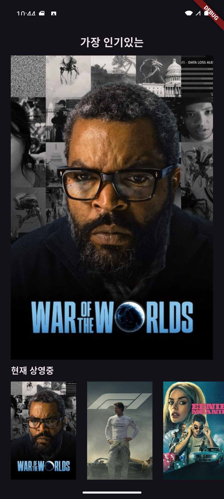
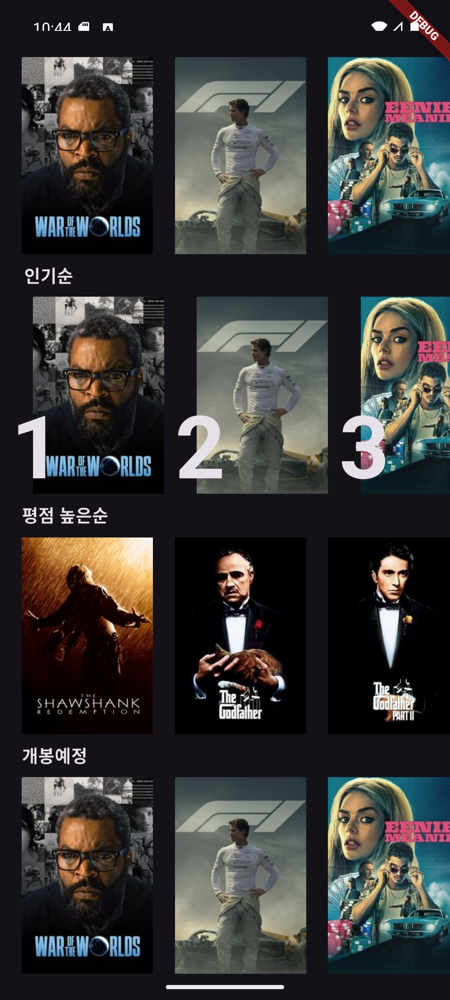
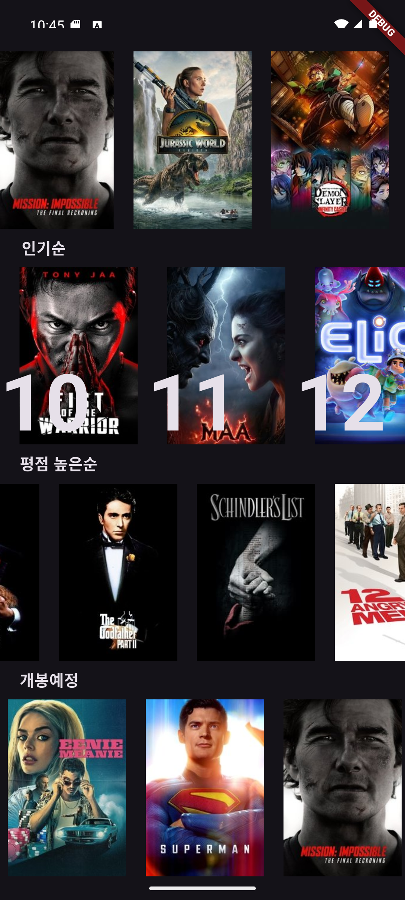
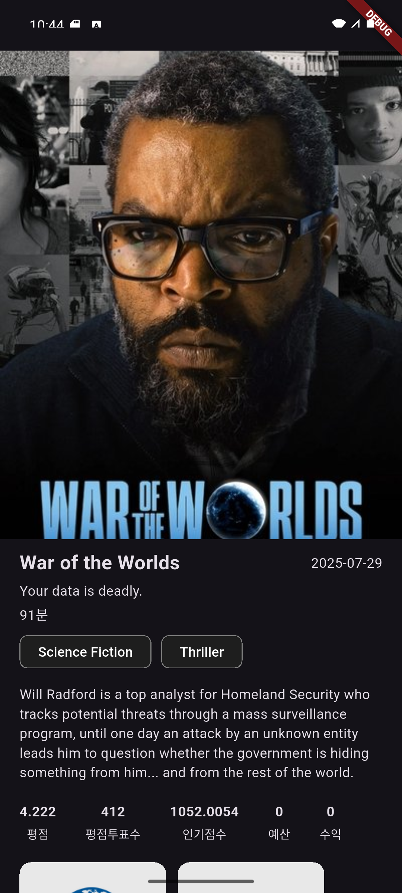
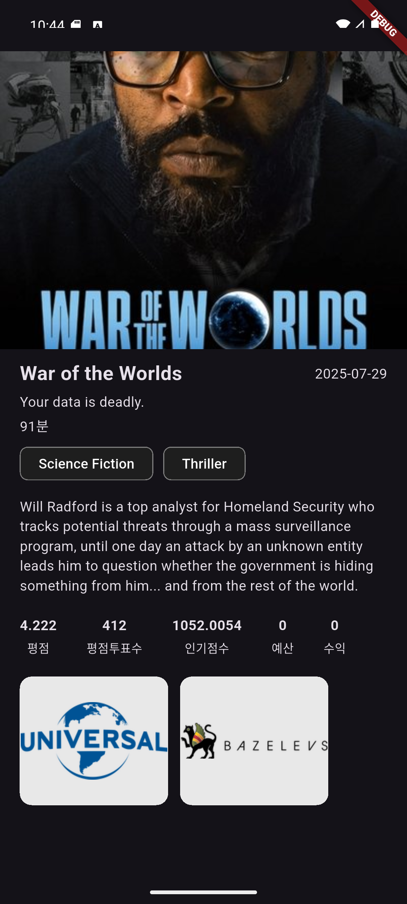
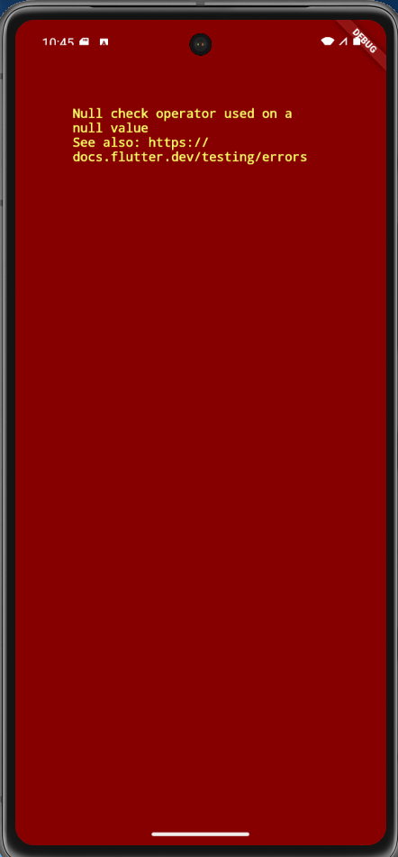

# 🎬 Movie Information App

TMDB API를 활용해 최신/인기/평점 높은 영화들을 탐색하고, 포스터 → 상세 화면으로 자연스럽게 전환되는 **Hero 애니메이션**을 경험할 수 있는 영화 정보 앱입니다.  
학습 목표는 **애니메이션 위젯 적용**, **클린 아키텍처 설계**, **외부 API 연동**입니다.

---

## ✨ 주요 기능 (Key Features)

### 홈 화면
- 상단 *가장 인기있는* 포스터 영역(패딩 20 제외 가로 전체)
- 가로 스크롤 리스트 4종: **현재 상영중 · 인기순 · 평점 높은순 · 개봉예정** (각 20개, item 높이 180)
- 섹션 라벨/칩 노출, **인기순 섹션은 랭킹 넘버 오버레이** 표시

### 상세 화면
- 포스터를 **가로 전체**로 보여주는 히어로 전환
- 기본 정보: **영화 제목, 개봉일, 태그라인, 런타임, 장르**
- 설명: **Overview**
- 지표: **평점, 투표수, 인기점수, 예산/수익**
- **제작사 로고** 가로 리스트(투명 배경)

### 애니메이션
- 리스트 아이템 → 상세 진입 시 **Hero 애니메이션** (두 화면에서 **동일 tag** 사용, 단일 위젯 내 tag **중복 금지**)

### 데이터 연동
- **TMDB API** 연동(Authorization: `Bearer <YOUR_TOKEN>`)
- 네트워크로 가져온 데이터를 클린 아키텍처 레이어에 맞춰 매핑/표시

---

## 사용자가 할 수 있는 일
- 홈에서 섹션별 영화들을 **가로 스크롤**로 탐색
- 포스터를 **터치**해 상세 화면으로 자연스러운 이동
- 상세 화면에서 영화의 **기본 정보,설명, 지표**를 한눈에 확인

---

## 🖼️ 예시화면

<p align="center">
  
  
  
</p>
<p align="center">
  
  
</p>

- 그리고 async/await을 잘 못쓴 부분이 있는건지, 아니면 뭔가 추가적인 처리를 해줬어야하는건지는 잘 모르겠지만
- 처음 앱을 켜서 API를 받아오는데 걸리는 시간, 포스터를 터치했을때 API를 불러오는 시간 동안 데이터가 없어서
- 이런 빨간 화면이 잠시 들어오는 문제를 발견했습니다.



- 한번 API를 받아오고 나면 다시 동일 포스터를 터치했을땐 문제없이 Hero 위젯이 작동하는 모습을 보실 수 있습니다.

---

## 기술 스택 + 아키텍처

**UI, 애니메이션**
- CustomScrollView / Sliver
- Hero Animation

**상태관리**
- Riverpod

**API**
- Dio
- TMDB

**Clean Architecture**
```
presentation/   # Page, ViewModel
domain/         # Entity, Repository Interface, UseCase
data/           # DTO, DataSource, Repository Implements
```

---
